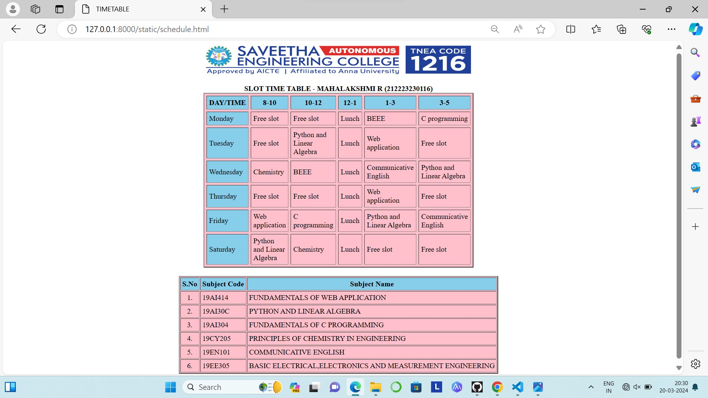

# Ex03 Time Table
## Date:14/3/24

## AIM
To write a html webpage page to display your slot timetable.

## ALGORITHM
### STEP 1
Create a Django-admin Interface.

### STEP 2
Create a static folder and inert HTML code.

### STEP 3
Create a simple table using ```<table>``` tag in html.

### STEP 4
Add header row using ```<th>``` tag.

### STEP 5
Add your timetable using ```<td>``` tag.

### STEP 6
Execute the program using runserver command.

## PROGRAM
```
<html>
    <head>
        <title>TIMETABLE</title>
    </head>
    <body>
        <center>
        
        </center>
        <br>
        <table align="center" border="2" cellspacing="5" cellpadding="5" width="40" height="50" bgcolor="pink">
            <caption> <b> SLOT TIME TABLE - MAHALAKSHMI R (212223230116)</b></caption>
            <tr>
                <th bgcolor="skyblue">DAY/TIME</th>
                <th bgcolor="skyblue">8-10</th>
                <th bgcolor="skyblue">10-12</th>
                <th bgcolor="skyblue">12-1</th>
                <th bgcolor="skyblue">1-3</th>
                <th bgcolor="skyblue">3-5</th>
            </tr>
            <tr>
                <td bgcolor="skyblue">Monday</td>
                <td>Free slot</td>
                <td>Free slot</td>
                <td>Lunch</td>
                <td>BEEE</td>
                <td>C programming</td>
            </tr>
            <tr>
                <td bgcolor="skyblue">Tuesday</td>
                <td>Free slot</td>
                <td>Python and Linear Algebra</td>
                <td>Lunch</td>
                <td>Web application</td>
                <td>Free slot</td>
            </tr>
            <tr>
                <td bgcolor="skyblue">Wednesday</td>
                <td>Chemistry</td>
                <td>BEEE</td>
                <td>Lunch</td>
                <td>Communicative English</td>
                <td>Python and Linear Algebra</td>
            </tr>
            <tr>
                <td bgcolor="skyblue">Thursday</td>
                <td>Free slot</td>
                <td>Free slot</td>
                <td>Lunch</td>
                <td>Web application</td>
                <td>Free slot</td>
            </tr>
            <tr>
                <td bgcolor="skyblue">Friday</td>
                <td>Web application</td>
                <td>C programming</td>
                <td>Lunch</td>
                <td>Python and Linear Algebra</td>
                <td>Communicative English</td>
            </tr>
            <tr>
                <td bgcolor="skyblue">Saturday</td>
                <td>Python and Linear Algebra</td>
                <td>Chemistry</td>
                <td>Lunch</td>
                <td>Free slot</td>
                <td>Free slot</td>
            </tr>
        </table>
        <br>
        <table align="center" cellspacing="2" cellpadding="4" border="2" bgcolor="pink">
            <tr>
                <th bgcolor="skyblue">S.No</th>
                <th bgcolor="skyblue">Subject Code</th>
                <th bgcolor="skyblue">Subject Name</th>
            </tr>
            <tr>
                <td align="center">1.</td>
                <td>19AI414</td>
                <td>FUNDAMENTALS OF WEB APPLICATION</td>
            </tr>
            <tr>
                <td align="center">2.</td>
                <td>19AI30C</td>
                <td>PYTHON AND LINEAR ALGEBRA</td>
            </tr>
            <tr>
                <td align="center">3.</td>
                <td>19AI304</td>
                <td>FUNDAMENTALS OF C PROGRAMMING</td>
            </tr>
            <tr>
                <td align="center">4.</td>
                <td>19CY205</td>
                <td>PRINCIPLES OF CHEMISTRY IN ENGINEERING</td>
            </tr>
            <tr>
                <td align="center">5.</td>
                <td>19EN101</td>
                <td>COMMUNICATIVE ENGLISH</td>
            </tr>
            <tr>
                <td align="center">6.</td>
                <td>19EE305</td>
                <td>BASIC ELECTRICAL,ELECTRONICS AND MEASUREMENT ENGINEERING</td>
            </tr>
        </table>
    </body>
</html>
```
## OUTPUT
 
## RESULT
The program for creating slot timetable using basic HTML tags is executed successfully.
